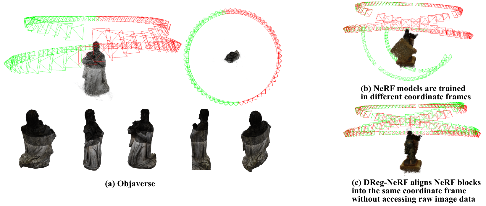

# DReg-NeRF

Official Implementation of our ICCV 2023 paper: "DReg-NeRF: Deep Registration for Neural Radiance Fields". [[Project Page](https://aibluefisher.github.io/DReg-NeRF/) | [ArXiv](http://arxiv.org/abs/2308.09386))



Given a pair of NeRF models that are trained in different coordinate frames, DReg-NeRF registers them into the same coordinate frame

## 1. Installation

```sh
conda create -n dreg_nerf python=3.9
conda activate dreg_nerf
cd DReg-NeRF/scripts
./scripts/env/install.sh
```

After installing the environment, you can **try our [pretrained model](https://drive.google.com/file/d/13OC3eKhqEhcB7WLPSkk3xGrHhaveG_Eh/view?usp=sharing) by following [# 4.2](#42-evaluation)** if you don't want to re-train all the NeRF models from scratch.

## 2. Fetch 3D Models from Objaverse

```sh
# Firstly, install conda env for blender:
cd DReg-NeRF/scripts/blender
pip install -r blender_environment.yml
# Then, we download models from Objaverse and render images.
./objaverse_to_blender.sh
```
After rendering images from 3D meshes, we put all the rendered images into `images` folder.

## 3. Train NeRF Blocks

Suppose the rendered images are put into `${DATA_ROOT_DIR}/objaverse/images`.

### 3.1 Train

```sh
cd scripts/train
GPU_IDX=0
./train_objaverse_batch.sh true ${GPU_IDX}
```

After training, checkpoints/models are stored at `${DATA_ROOT_DIR}/objaverse/images/out`.

### 3.2 Evaluation & Preprocessing

```sh
cd scripts/eval
GPU_IDX=0
./eval_objaverse_batch.sh true ${GPU_IDX}
```
After evaluation, results are stored at `${DATA_ROOT_DIR}/objaverse/images/eval`. During evaluation, we also pre-extracted occupancy grids from the NeRF models in each block and store them at `${DATA_ROOT_DIR}/objaverse/images/out`. To save disk storage, we only store `model.pth`, `voxel_grid.pt`, `voxel_mask.pt` and `voxel_point_cloud.ply` in each NeRF block models. Before training DReg-NeRF, you should check whether the trained NeRF models are good enough.


## 4. Train DReg-NeRF

Before training DReg-NeRF, we put the pre-extracted occupancy grids and NeRF models into a folder named `nerf_models` and put in at the same level to the `images` folder. Then, all the input required to train DReg-NeRF are stored at `${DATA_ROOT_DIR}/objaverse/nerf_models`.

## 4.1 Train

```sh
cd scripts/train
GPU_IDX=0
./train_nerf_regtr.sh ${GPU_IDX}
```
After training, checkpoints are stored at `${DATA_ROOT_DIR}/out/$expname`.

## 4.2 Evaluation

Downloading the [evaluation data](https://drive.google.com/drive/folders/1iQ7TlcqCbbKDBnEt4QBxaV2k1N1vQZzm?usp=sharing) to test DReg-NeRF.
```sh
cd scripts/train
GPU_IDX=0
./eval_nerf_regtr.sh objaverse test 0
```

After evaluation, results are stored at `~/DATASETS/dreg_nerf/eval/$expname`.


## Cite

If you find our work useful for your research, please cite our paper as below:
```
@article{DBLP:journals/corr/abs-2308-09386,
  author    = {Yu Chen and
               Gim Hee Lee},
  title     = {DReg-NeRF: Deep Registration for Neural Radiance Fields},
  booktitle = {2023 {IEEE/CVF} International Conference on Computer Vision},
  pages     = {},
  year      = {2023},
}
```
